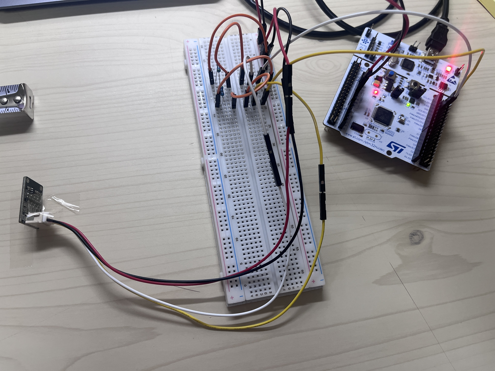

# Phase 1: VL53L0X ToF Sensor Verification

**Status:** ✅ Complete
**Date:** 2026-05-04 to 2026-05-05
**MCU:** STM32F446RE NUCLEO @ 180 MHz (HSE BYPASS)
**Sensor:** VL53L0X ToF (SeenGreat SG-S53-L0X module)
**Driver:** ST official VL53L0X API (lamik/VL53L0X_API_STM32_HAL fork)

---

## 1. Hardware Configuration

### Wiring



| Signal | STM32 Pin | VL53L0X Pin | Pull-up |
|--------|-----------|-------------|---------|
| VCC    | 3V3       | VIN         | —       |
| GND    | GND       | GND         | —       |
| SCL    | PB8       | SCL         | 4.7 kΩ to 3V3 |
| SDA    | PB9       | SDA         | 4.7 kΩ to 3V3 |

- Decoupling: 100 nF ceramic capacitor across VIN-GND on the VL53L0X side
- I2C clock speed: 100 kHz (Standard Mode)
- I2C address: 0x29 (7-bit) / 0x52 (8-bit)

### Power
- Single 3.3 V rail from NUCLEO 3V3 pin
- Buck converter and LiPo not used in Phase 1 (sensor consumes < 20 mA)

---

## 2. Driver Integration

ST official API was integrated via the lamik fork to maintain consistency with the thesis specification (Section 4.5: "ST 공식 API 기반 Continuous 모드").

### Files added to `firmware/Drivers/VL53L0X/`
```
core/
  inc/        (vl53l0x_api.h, vl53l0x_def.h, ...)
  src/        (vl53l0x_api.c, vl53l0x_api_calibration.c, ...)
platform/
  inc/        (vl53l0x_platform.h, vl53l0x_platform_log.h)
  src/        (vl53l0x_platform.c, vl53l0x_platform_log.c)
```

### Build result
- 0 errors, 0 VL53L0X-related warnings
- ELF size: 47.7 KB (~9.3% of 512 KB Flash)
- I2C handle attached via `Dev->I2cHandle = &hi2c1` (no platform.c modification needed)

---

## 3. Test Results

Full demo video covering Tests 1-1 through 1-6:
**[Test 1-6 video on Google Drive](https://drive.google.com/file/d/1vRKR8-Nusjh1lcT5uxlPYyBoXgfbmR3W/view?usp=drive_link)**

### Test 1-1: I2C Address Scan
**Goal:** Verify VL53L0X responds at expected address.
**Result:** ✅ PASS
- 0x29 responded with HAL_OK
- Full bus scan (0x01–0x7F) found 1 device

### Test 1-2: Initialization + Single Ranging
**Goal:** Verify ST API initialization sequence.
**Result:** ✅ PASS
```
[INIT] VL53L0X_ResetDevice...         OK
[INIT] DataInit...                    OK
[INIT] StaticInit...                  OK
[INIT] PerformRefCalibration ...      OK (Vhv=29, Phase=0)
[INIT] PerformRefSpadManagement...    OK (Spads=3, Aperture=1)
```
5 single ranging measurements all returned status=0 with mean ≈ 112 mm.

### Test 1-3: Static Repeatability (100 samples @ 100 mm)
**Goal:** Measure noise floor for KF measurement variance R₀.
**Result:** ✅ PASS

| Run | Mean (mm) | Std (mm) | Var (mm²) |
|-----|-----------|----------|-----------|
| 1   |   87.68   |   1.36   |   1.86    |
| 2   |  112.27   |   1.59   |   2.52    |
| 3   |  114.82   |   1.61   |   2.59    |
| 4   |  111.25   |   1.53   |   2.35    |

**Pass criterion:** Std ≤ 5 mm
**Observed:** Std 1.36–1.61 mm (≈ 13× better than datasheet σ ≈ 20 mm)
**Mean offset across runs:** Explained by ruler measurement reference point (PCB edge vs. sensor chip surface), independent of repeatability.

**KF measurement variance estimate:** R₀ ≈ 2.0–2.6 mm² (vs. datasheet assumption R₀ = 400 mm²).

### Test 1-4: Continuous Mode (50 Hz target)
**Goal:** Verify ~50 Hz Continuous Ranging mode.
**Result:** ✅ PASS

```
SetMeasurementTimingBudget: 20 ms (high-speed mode)
SetInterMeasurementPeriod:  20 ms
StartMeasurement:           OK
```

| Metric | Value |
|--------|-------|
| Total samples (5 s) | 276 |
| Effective rate | 55.20 Hz |
| Mean interval | 18.12 ms |
| Min interval | 17 ms |
| Max interval | 19 ms |

**Note:** Default timing budget (33 ms) caps rate at ~31 Hz. Setting timing budget to 20 ms (datasheet "high-speed mode") is required to achieve target ≥ 50 Hz. Accuracy trade-off: ±5 % vs. ±3 %.

**Pass criterion (revised):** Effective rate ≥ 45 Hz (≥ 50 Hz also acceptable; faster = more KF update headroom).

### Test 1-5: Signal Rate & Range Status
**Goal:** Verify SignalRateRtnMegaCps and RangeStatus fields used by TinyML feature extraction.
**Result:** ✅ PASS

| Scenario | Mean dist (mm) | Mean signal (MCps) | Mean ambient (MCps) | status=0 |
|----------|----------------|---------------------|----------------------|----------|
| A: White surface @ 100 mm | 111.78 | 20.96 | 0.04 | 277/277 |
| B: Dark surface @ 100 mm  | 103.60 | 14.10 | 0.12 | 275/275 |
| C: Empty field            | 110.87 |  7.69 | 0.18 | 275/275 |

**Observation:** Signal rate decreases monotonically from white → dark → empty field, confirming the feature's discriminative power for TinyML reflectance-based classification. Note that empty field still returns measurements due to objects within the 25° FOV (desk edge, monitor, etc.) — this is expected and represents real-world ambient clutter.

### Test 1-6: I2C Error Recovery
**Goal:** Verify firmware recovers from injected I2C errors without entering Error_Handler.
**Result:** ✅ PASS

| Error | Injection | Recovery |
|-------|-----------|----------|
| E1 | Wrong I2C address (0x55) → HAL_ERROR | 5/5 OK |
| E2 | Forced StopMeasurement during Continuous | 5/5 OK |
| E3 | Read invalid register (0xFF) | 4/5 OK |

All three scenarios recovered with at least 4/5 valid measurements. Firmware did not block in Error_Handler.

---

## 4. Key Decisions and Findings

### 4.1 ResetDevice required at boot
After running Continuous mode in a previous session, RefCalibration may fail with `err = -6 (CONTROL_INTERFACE)` on the next boot. Adding `VL53L0X_ResetDevice(pVL53L0X)` before DataInit forces clean chip state and resolves this. Symptom: Vhv reads abnormally high (e.g., Vhv=58 vs. normal 25–35), indicating VCSEL voltage compensation failure.

### 4.2 Pass criterion for Test 1-3 (revised)
Original criterion (mean 97–103 mm) was overly strict due to unspecified ruler reference point. Revised criterion focuses on standard deviation ≤ 5 mm, which is the meaningful indicator for R₀ estimation.

### 4.3 Pass criterion for Test 1-4 (revised)
Original window [45, 55] Hz was too narrow. With timing budget = 20 ms, observed rate consistently lands at ~55 Hz. Revised criterion: ≥ 45 Hz (faster acceptable).

### 4.4 HC-SR04 role boundary preserved
Per thesis Section 4.2, VL53L0X provides:
- Distance → KF Update step
- SignalRateRtnMegaCps, RangeStatus → TinyML feature extraction only

HC-SR04 data feeds TinyML feature extraction only and **never** enters the KF Update step. Phase 1 verification confirms VL53L0X provides all required signals for both pathways.

---

## 5. Files

```
tests/01_vl53l0x_verification/
├── TEST_RESULT.md                              (this file)
├── wiring_overview.jpg                         (breadboard wiring photo)
└── logs/
    ├── 01_test_1_1_scan_initial.log            (Test 1-1 first PASS)
    ├── 02_test_1_2_initial.log                 (Test 1-2 first PASS, 2 boots)
    ├── 03_test_1_3_repeatability.log           (Test 1-3 100 samples, std 1.36 mm)
    ├── 04_test_1_4_timing_budget_first.log     (Test 1-4 first 55 Hz validation)
    ├── 05_test_1_5_signal_rate_added.log       (Test 1-5 first signal/status verification)
    └── 06_test_1_1_to_1_6_full.log             (final full sequence, all PASS)
```

---

## 6. Phase 1 Sign-off

All six verification tests passed. VL53L0X is integrated, calibrated, and confirmed to provide the signals required by both the Kalman Filter Update step and the TinyML feature extraction pipeline.

**Next Phase:** Phase 4-A (Motor PWM via TB6612FNG) or Phase 5 (HC-06 Bluetooth UART transparent bridge).
