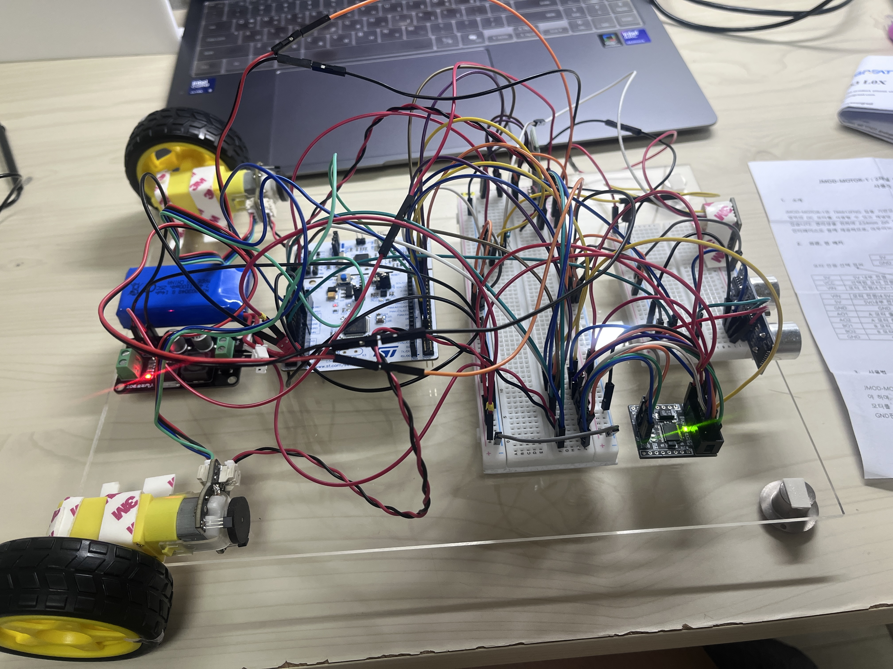

# Phase 4-B: Motor + Sensor Noise Verification

**Date:** 2026-05-15
**Board:** NUCLEO-F446RE (STM32F446RET6)
**Author:** Yubin Shin

---

## 1. Objective

This phase quantifies the noise impact on the VL53L0X ToF sensor when both TB6612FNG-driven FIT0450 motors are running. The Phase 1 baseline established that the VL53L0X achieves σ = 1.53 mm at 100 mm in a quiescent system (motors off, no external noise sources). The Kalman Filter relies on this measurement as its sole observation input, so any motor-induced degradation directly affects KF and CM-AKF performance in Phase 6 and Phase 7.

The hypothesis under test is whether motor operation degrades the VL53L0X measurement quality through one or more of the following mechanisms: PWM electrical noise on the shared ground network, motor EMI coupling into the I²C lines, or power rail disturbance through the Buck converter.

This is also the empirical basis for the Phase 7 verification strategy decision: motor-driven autonomous run vs. manual rolling. The Phase 7 strategy was tentatively set to manual rolling on the assumption that motor noise might compromise the sensor signal. This phase determines whether that assumption holds.

## 2. Background

### 2.1 Noise Source Analysis

In a 2WD platform with shared electrical infrastructure, the VL53L0X is exposed to four motor-related noise paths:

1. **PWM electrical noise on power rail** — TB6612FNG switching at ~2.75 kHz (TIM1 ARR=65535, HCLK=180 MHz) draws pulsed current from the LiPo, which propagates through the Buck converter to the 5 V rail and into the NUCLEO's internal LDO that feeds the VL53L0X 3.3 V supply.
2. **Motor EMI** — brushed DC motors generate broadband electromagnetic interference from commutator arcing. Long signal traces (I²C SDA/SCL on jumper wires) can pick up this radiation.
3. **Ground bounce** — high-current motor return paths through a shared ground network can shift the local ground reference seen by the I²C lines, causing intermittent NACKs.
4. **Mechanical vibration** — once the chassis is on a surface and the wheels are rolling, motor torque variations transmit through the chassis to the sensor mount, perturbing the optical axis.

The static test (chassis lifted, wheels free) isolates the first three electrical paths. The running test (chassis on floor) adds the fourth mechanical contribution.

### 2.2 Phase 7 Strategy Decision Context

The thesis verification plan (Phase 7) compares Fixed KF, CM-AKF, and TinyML-AKF across five scenarios (E1–E5). The original plan called for motor-driven autonomous 2 m runs. After preliminary observation, the strategy was revised to manual rolling for three independent reasons: motor noise on sensors (this phase), 2WD lateral drift over distances greater than ~50 cm without a guide rail, and tire slip on smooth surfaces injecting encoder integration error into the KF prediction step.

This phase resolves the first concern quantitatively. The other two remain valid regardless of this phase's outcome.

### 2.3 Hardware-Clean vs. Algorithm-Clean Signal

A clean separation between hardware-induced and algorithm-induced KF degradation is essential for thesis claims. If motor noise contaminates the sensor signal, any KF performance variation in Phase 6 or Phase 7 could be attributed to either the algorithm or the sensor. This phase certifies the sensor as hardware-clean during motor operation, so that subsequent algorithm comparisons are unambiguous.

## 3. Hardware Configuration

### 3.1 Wiring Overview



The full setup integrates Phases 0–5 hardware on a single A4 acrylic plate: LiPo and Buck on the left, NUCLEO with main breadboard (TB6612FNG, HC-06) in the center, sub-breadboard (VL53L0X, HC-SR04) on the right, and motors mounted at the front-left/front-rear with wheels extending past the plate edge.

### 3.2 Components

| Component | Specification | Role |
|-----------|---------------|------|
| MCU board | NUCLEO-F446RE | Sensor host, motor PWM generator |
| Motor driver | TB6612FNG (JMOD-MOTOR-1) | Dual H-bridge, 50 % PWM duty |
| Motors | FIT0450 ×2 (DFRobot, 6 V rated, 960 PPR) | Drive wheels, ran at 50 % PWM |
| ToF sensor | VL53L0X (Pololu-style, custom lightweight driver) | Sensor under test |
| Ultrasonic | HC-SR04 | Secondary sensor (Phase 3 already verified) |
| Bluetooth | HC-06 SZH-EK010 (Phase 5 verified) | Telemetry channel |
| Buck converter | LM2596 (YwRobot PWR060010, fixed 5 V) | LiPo 7.4 V → 5 V for NUCLEO |
| Battery | LiPo 7.4 V 2S | Sole power source during measurement |

### 3.3 Pin Assignments

| Function | Pin | Peripheral | Notes |
|----------|-----|------------|-------|
| Motor A PWM | PA8 | TIM1_CH1 | Duty 32768 / 65535 = 50 % |
| Motor B PWM | PA9 | TIM1_CH2 | Duty 32768 / 65535 = 50 % |
| Motor A direction | PC8 / PC9 | GPIO Output | AIN1=HIGH, AIN2=LOW |
| Motor B direction | PC10 / PC11 | GPIO Output | BIN1=HIGH, BIN2=LOW (corrected at wiring level for chassis-relative direction) |
| Motor driver STBY | PC12 | GPIO Output | HIGH = enabled |
| VL53L0X I²C | PB8 / PB9 | I2C1 (SCL/SDA) | 4.7 kΩ pull-up to 3.3 V |
| HC-SR04 Trigger | PA1 | GPIO Output | 10 µs pulse via DWT |
| HC-SR04 Echo | PA6 | TIM3_CH1 Input Capture | Interrupt-driven |
| Telemetry TX | PC6 | USART6_TX | HC-06 link, 115200 baud |
| User button | PC13 | GPIO Input | B1 polling for measurement trigger |

### 3.4 Power Configuration During Measurement

USB cable was **disconnected** during all measurement runs. The system was powered solely from LiPo → Buck → NUCLEO 5 V pin. This is critical because a connected USB cable would partially absorb power rail noise through the USB host's 5 V supply, masking the very noise mechanism this phase is designed to measure. The LiPo terminal voltage was confirmed ≥ 7.4 V before each measurement.

## 4. CubeMX / CubeIDE Configuration

### 4.1 VL53L0X Operating Mode

Same as Phase 1 Test 1-4 (verified at 50 Hz):

| Parameter | Value |
|-----------|-------|
| Mode | CONTINUOUS_RANGING |
| Timing budget | 20 ms (high-speed) |
| Inter-measurement period | 20 ms |
| Effective rate | ~50 Hz |
| I²C address | 0x29 (7-bit) |
| I²C clock speed | 100 kHz |

### 4.2 TIM1 PWM Configuration

| Parameter | Value |
|-----------|-------|
| Mode | PWM (Output Compare) |
| Channels | CH1 (PA8 PWMA), CH2 (PA9 PWMB) |
| Prescaler | 0 |
| ARR (Period) | 65535 |
| PWM frequency | ~2.75 kHz |
| 50 % duty CCR value | 32768 |

### 4.3 Other Settings

- System clock: 180 MHz via HSE BYPASS (8 MHz ST-LINK MCO)
- USART6 retained for HC-06 telemetry (`__io_putchar` redirected from USART2 to USART6)

## 5. Firmware Implementation

### 5.1 Measurement Sequence

The firmware executes a deterministic sequence after the user presses B1:

```c
Wait_For_B1_Press();          // Poll PC13 with 50 ms debounce
Motor_Start_50pct();          // PWM=50%, both motors same chassis direction
HAL_Delay(1000);              // Steady-state wait, avoid PWM startup transient
VL53L0X_StartMeasurement();   // Begin continuous ranging

for (i = 0; i < 100; i++) {
    // Poll data ready, read measurement, accumulate sums for σ calculation
    // Trigger HC-SR04 every 10th iteration (5 Hz)
    // Print per-sample CSV: idx, vl_dist_mm, vl_status, vl_signal_MCps, sr04_us
}

VL53L0X_StopMeasurement();
Motor_Stop();
// Print final statistics: mean, σ, min, max, status0 count, I²C error count
```

### 5.2 Statistics Accumulation

To avoid storing a 100-element array, running sums are accumulated:

```c
if (m.RangeStatus == 0) {
    vl_status0_count++;
    vl_sum    += (double)m.RangeMilliMeter;
    vl_sum_sq += (double)m.RangeMilliMeter * (double)m.RangeMilliMeter;
}
// At end:
mean = sum / N;
var  = sum_sq / N - mean * mean;
sigma = sqrt(var);
```

Only `RangeStatus == 0` samples are included in mean/σ. This excludes Sigma-fail and out-of-range samples, which would otherwise distort the noise estimate.

### 5.3 Telemetry over Bluetooth

All `printf` output is redirected to USART6 (HC-06) via `__io_putchar`:

```c
int __io_putchar(int ch) {
    HAL_UART_Transmit(&huart6, (uint8_t *)&ch, 1, HAL_MAX_DELAY);
    return ch;
}
```

This matches the Phase 7 operating condition: no USB cable, all telemetry over Bluetooth. The Phase 5 verification confirmed HC-06 stability at 115200 baud with zero drops over 55 seconds of continuous 50 Hz streaming.

## 6. Test Procedure and Results

Two configurations were tested: a **static** setup (chassis lifted, wheels free) and a **running** setup (chassis placed on a smooth tile floor, allowed to drive freely until wall impact).

### 6.1 Step 1: Static Measurement (×3 runs)

**Procedure:**
1. Lift chassis on books so wheels are off the floor.
2. Place A4 white paper at ~142 mm perpendicular to the VL53L0X optical axis.
3. Disconnect USB, verify LiPo power and HC-06 telemetry over PuTTY (COM6 Outgoing).
4. Press B1, allow 1 s steady-state, capture 100 samples.
5. Repeat three times.

**Results:**

| Run | Status=0 | Mean dist (mm) | σ (mm) | Min (mm) | Max (mm) | I²C err |
|---:|:---:|:---:|:---:|:---:|:---:|:---:|
| 1 | 100/100 | 142.48 | 2.63 | 135 | 148 | 0 |
| 2 | 100/100 | 142.41 | 2.40 | 136 | 147 | 0 |
| 3 | 100/100 | 142.76 | 2.37 | 136 | 149 | 0 |
| **Total** | **300/300** | **142.55** | **2.47** | 135 | 149 | **0** |

Signal Rate during measurement: 21–22 MCps (strong, comparable to Phase 1 Test 1-5 white-target reading), indicating no signal attenuation from motor EMI on the I²C lines.

**Verdict:** PASS

### 6.2 Step 2: Running Measurement (1 run, smooth tile floor)

**Procedure:**
1. Place chassis on smooth tile floor with ~80 cm of clearance ahead.
2. No guide rail; chassis allowed to drift naturally.
3. Press B1 and let the run complete (including wall impact).

**Sample timeline interpretation:**

| Sample range | Phase | Behavior |
|---|---|---|
| 1–60 | **Pre-collision driving** | Distance to wall decreases monotonically from 347 mm to 52 mm |
| 61–70 | Collision transition | Values diverge as chassis hits wall and bounces |
| 71–100 | **Post-collision wheel slip** | Chassis stopped against wall, motors still at 50 % PWM, wheels slipping |

**Pre-collision driving (samples 1–60, 1.20 s, 295 mm traversed):**

| Metric | Value |
|---|---|
| Start distance | 347 mm |
| End distance | 52 mm |
| Average forward speed | 245.8 mm/s (24.6 cm/s) |
| Per-sample Δ | mean 5.00 mm / 20 ms |
| Linear fit residual σ | **3.10 mm** (noise after detrending the monotonic motion) |
| Residual range | −5.84 to +8.18 mm |
| Status=0 | 60/60 |
| I²C errors | 0 |

Because the chassis is moving, the raw σ of the distance series is dominated by actual motion, not noise. The meaningful noise figure is the residual standard deviation after subtracting a linear fit of (distance vs. sample index). This residual σ of 3.10 mm represents the combined effect of motor electrical noise, motor EMI, and minor chassis vibration during forward motion.

**Post-collision (samples 71–100, motors still at full PWM against wall):**

| Metric | Value |
|---|---|
| Mean distance | 19.03 mm |
| σ | **2.68 mm** |
| Min / Max | 14 / 23 mm |
| Status=0 | 30/30 |
| I²C errors | 0 |

This is a worst-case stationary-with-motors-running condition: full motor current draw, wheels slipping (high friction and vibration), measurement near VL53L0X minimum range. Even here, σ remains within 2× of the Phase 1 baseline.

**Verdict:** PASS

### 6.3 Three-Tier Noise Comparison

| Condition | σ (mm) | Δσ vs. baseline | Multiplier | Status=0 | I²C err |
|---|:---:|:---:|:---:|:---:|:---:|
| Phase 1 baseline (motor OFF, static, 100 mm) | 1.53 | — | 1.00× | 100/100 | 0 |
| Phase 4-B static (motor ON, 142 mm) | 2.47 | +0.94 | 1.61× | 300/300 | 0 |
| Phase 4-B running pre-collision (detrended) | 3.10 | +1.57 | 2.03× | 60/60 | 0 |
| Phase 4-B post-collision (wheel slip) | 2.68 | +1.15 | 1.75× | 30/30 | 0 |

The σ multiplier never exceeds 2.03× across all motor-on conditions, and the I²C error count is zero across 390 motor-on samples in total. VL53L0X measurement quality is preserved during motor operation.

### 6.4 HC-SR04 Result

HC-SR04 was triggered every 10 samples (10 attempts per run). The majority of attempts returned echo timeouts in both static and running setups. This is attributed to the small target (A4 paper does not reflect ultrasonic energy well) and the ±15° beam angle missing the narrow target. HC-SR04 was already validated in Phase 3 with appropriate reflectors; this phase's HC-SR04 data is informational only and does not affect the Phase 4-B verdict.

### 6.5 Video Documentation

Running test footage (smooth tile floor, 50 % PWM forward drive, wall impact at ~1.4 s):

[](https://youtu.be/jmzdptTFuv0)

The footage corresponds to `puttyBT_running.log` samples 1–100.

## 7. Troubleshooting Log

### Issue 1: Initial Test Setup Without a Visible Target

**Symptom:** The first three measurement runs returned `Status=0 count: 0/100` to `1/100`, with the VL53L0X reporting status codes 2 (Sigma fail) and 4 (Out of range) for nearly every sample. The σ statistic could not be computed.

**Root cause:** The chassis was being held in mid-air during measurement with no physical target placed in front of the VL53L0X. The sensor was looking at empty space (or a distant ceiling), so no valid return was registered.

**Resolution:** Re-staged the static test with a clearly defined white target (A4 paper) at a fixed ~142 mm distance perpendicular to the sensor's optical axis. Status=0 immediately returned to 100/100.

**Lesson:** Always verify the experimental setup has the intended target geometry before interpreting noise data. A near-zero status=0 count is a setup-failure signal, not a noise-severity signal.

### Issue 2: NUCLEO Power Loss After USB Disconnect

**Symptom:** After flashing firmware and removing the USB cable to switch to LiPo-only operation, the NUCLEO appeared dead: B1 and RESET buttons unresponsive, LD3 only faintly lit, no Bluetooth telemetry.

**Root cause:** The Buck converter's 5 V output wire was not actually connected to the NUCLEO 5 V pin. The connection had been assumed during wiring setup but never verified end-to-end with the multimeter. With USB providing 5 V, the system appeared to work; once USB was removed, the NUCLEO lost power entirely.

**Resolution:** Re-seated the Buck 5 V output into the NUCLEO 5 V pin on the Morpho header and confirmed continuity. After re-connection, USB-disconnect operation worked correctly: LD1 lit steadily, B1 / RESET responsive, HC-06 maintained pairing.

**Lesson:** When transitioning between USB and battery operation, always verify the battery-side power path is complete *before* removing USB, ideally by measuring NUCLEO 5 V pin voltage with the multimeter while USB is unplugged.

### Issue 3: Initial Motor Wiring Caused Wheel Reversal

**Symptom:** With identical PWM and direction signals applied to both motors (AIN1=BIN1=HIGH, AIN2=BIN2=LOW), the two wheels rotated in opposite directions relative to the chassis, producing in-place rotation rather than forward motion.

**Root cause:** On a 2WD platform, the left and right motors are physically mounted as mirror images of each other. The same electrical signal therefore produces opposite chassis-relative rotation. This is a standard 2WD design feature, not a wiring error.

**Resolution:** Swapped the motor B wire pair at the TB6612FNG output side (BOUT1 ↔ BOUT2). This inverts motor B's direction without touching the firmware logic, keeping the AIN/BIN signal pattern symmetric. After the swap, both wheels rotated in the same chassis direction at the same direction signals.

**Lesson:** For 2WD platforms, motor direction correction is best handled at the wiring level (motor terminal swap) rather than in firmware. This keeps the abstraction clean — "both motors forward" means the same signal pattern in code regardless of physical mounting.

### Issue 4: Static σ Calculation Returns 0 with No Valid Samples

**Symptom:** Statistics output showed `Std (sigma): 0.00 mm`, `Min: 65535 mm`, `Max: 0 mm` when status=0 count was 0/100.

**Root cause:** Not a bug. The `Min`/`Max` initial values are 0xFFFF / 0 respectively, and σ calculation requires at least 2 status=0 samples. With 0 valid samples, the initial values are never updated and σ remains at its initial 0.

**Resolution:** No firmware change needed. The condition `status0_count == 0` is itself the diagnostic signal that the sensor is failing entirely, which is more informative than a bogus σ value would be.

**Lesson:** Statistical outputs of 0.00 alongside Min > Max are a clear "no valid data" signature. The firmware does not need to explicitly print "no data" because the pattern is self-evident from the values.

## 8. Confirmed Parameters

| Parameter | Value |
|-----------|-------|
| VL53L0X timing budget | 20 ms |
| VL53L0X effective rate | ~50 Hz |
| Motor PWM frequency | ~2.75 kHz |
| Motor PWM duty | 50 % (CCR = 32768 / 65535) |
| Steady-state wait | 1000 ms after motor start |
| Samples per run | 100 (VL53L0X), 10 (HC-SR04) |
| Telemetry channel | HC-06 USART6, 115200 baud |
| Phase 1 baseline σ | 1.53 mm (motor OFF, 100 mm) |
| Phase 4-B static σ (mean of 3 runs) | 2.47 mm (motor ON, 142 mm) |
| Phase 4-B running σ (detrended) | 3.10 mm (motor ON, forward motion) |
| Maximum σ multiplier vs. baseline | 2.03× |
| Total motor-on samples collected | 390 |
| Total I²C errors | 0 |
| Total status=0 rate | 100 % (390/390) |

## 9. Discussion and Limitations

### 9.1 Interpretation of the σ Increase

The +0.94 mm increase between Phase 1 baseline (1.53 mm) and Phase 4-B static (2.47 mm) quantifies the pure electrical noise contribution from motor operation (PWM noise + EMI + ground bounce). The further increase to 3.10 mm in the running condition adds ~0.6 mm attributable to chassis vibration during forward motion. Both increases are small in absolute terms and remain well within the noise budget needed for a Kalman Filter operating on millimeter-scale distance measurements.

### 9.2 Test Distance Not Identical to Baseline

The Phase 1 baseline was measured at 100 mm, while the Phase 4-B static measurements settled at ~142 mm due to the physical setup with the chassis on books. VL53L0X noise has some distance dependence, but Phase 1 Test 1-5 confirmed σ remains in a similar range across white-target distances of 100–400 mm. The 42 mm distance difference is therefore a minor contributor to the observed σ change; the dominant contribution is the introduction of motor noise.

### 9.3 Running Test Was a Single Run

The running measurement was a single run rather than a triplicate, because the chassis hits a wall at the end of each run and re-staging takes time. The pre-collision linear fit and residual σ are statistically meaningful (60 samples over 1.2 s, R² implied very high by the visible linearity), but the absence of run-to-run variance data is a limitation. The static triplicate compensates for this by confirming repeatability of the dominant electrical-noise contribution.

### 9.4 Surface Type Was Smooth Tile

The running test was conducted on a smooth tile floor, which minimizes chassis-vibration noise from surface roughness. On a rougher surface (carpet, wooden floorboards), σ during running would likely be higher. However, the Phase 7 manual rolling plan also targets smooth surfaces, so this measurement reasonably reflects the intended deployment condition.

### 9.5 HC-SR04 Not Conclusively Evaluated

The HC-SR04 echo timeouts in this phase do not indicate a hardware failure; they indicate the target geometry was unsuitable for ultrasonic sensing. Phase 3 already verified HC-SR04 functionality with appropriate reflectors. A future test with a larger reflective target could quantify HC-SR04 motor noise, but this is not on the critical path for thesis claims, since the primary sensor under analysis is the VL53L0X.

### 9.6 Phase 7 Manual Rolling Justification

This phase rules out motor sensor noise as a justification for manual rolling in Phase 7. The remaining justifications stand on independent grounds:

- **Variable control**: KF / CM-AKF / TinyML-AKF comparison requires isolating algorithm behavior from motor / PID / wheel-slip variables.
- **2WD lateral drift**: without a guide rail, the chassis drifts measurably over distances above ~50 cm, which would invalidate the wall-distance measurement geometry over a planned 2 m run.
- **Tire slip on smooth surfaces**: the post-collision section of the running test confirmed that FIT0450 wheels slip readily on smooth tile under full PWM, which would inject encoder integration error into the KF prediction step.

Phase 7 manual rolling is therefore an experimental-design choice for variable control, not a workaround for sensor noise.

## 10. Next Steps

Phase 4-B verification is complete. The hardware platform is certified noise-clean for sensor measurements during motor operation, and the Phase 7 manual rolling strategy is now grounded in experimental-design rationale rather than noise-mitigation rationale.

- **Phase 6 (next):** Sensor + KF integration at 200 Hz internal loop, motors off. The certified-clean VL53L0X signal allows attributing any KF behavior in Phase 6 purely to algorithm tuning.
- **Phase 7:** Full integration with manual rolling. Scenarios E1–E5 will use the same telemetry chain verified in Phase 5 (HC-06) with the same sensor signal quality verified in Phase 4-B.
- **Thesis Chapter 4.1.4:** This phase's three-tier comparison (1.53 / 2.47 / 3.10 mm) is the primary numerical evidence for the "hardware integration verification" section. The video link can be referenced in the thesis appendix or supplementary material.

## Appendix A: Captured PuTTY Logs

- `logs/puttyBT_static.log` — Static measurements over Bluetooth, 3 consecutive runs at ~142 mm with motor on (results in §6.1).
- `logs/puttyBT_running.log` — Running measurement over Bluetooth, forward drive on smooth tile floor with wall impact at sample ~65 (results in §6.2).

Earlier PuTTY logs captured during setup debugging are not archived because they reflect setup errors (no target placed in front of sensor, missing 5 V connection between Buck and NUCLEO) rather than valid measurements.

## Appendix B: Reference Documents

- ST UM2039 — VL53L0X API user manual (Continuous Ranging mode, Timing Budget configuration)
- TB6612FNG datasheet — Toshiba dual H-bridge characteristics
- Phase 1 TEST_RESULT.md — VL53L0X baseline (100 mm, σ = 1.53 mm, 55.20 Hz)
- Phase 3 TEST_RESULT.md — HC-SR04 baseline (TIM3 Input Capture, interrupt-driven)
- Phase 5 TEST_RESULT.md — HC-06 Bluetooth telemetry chain (used as output channel here)
