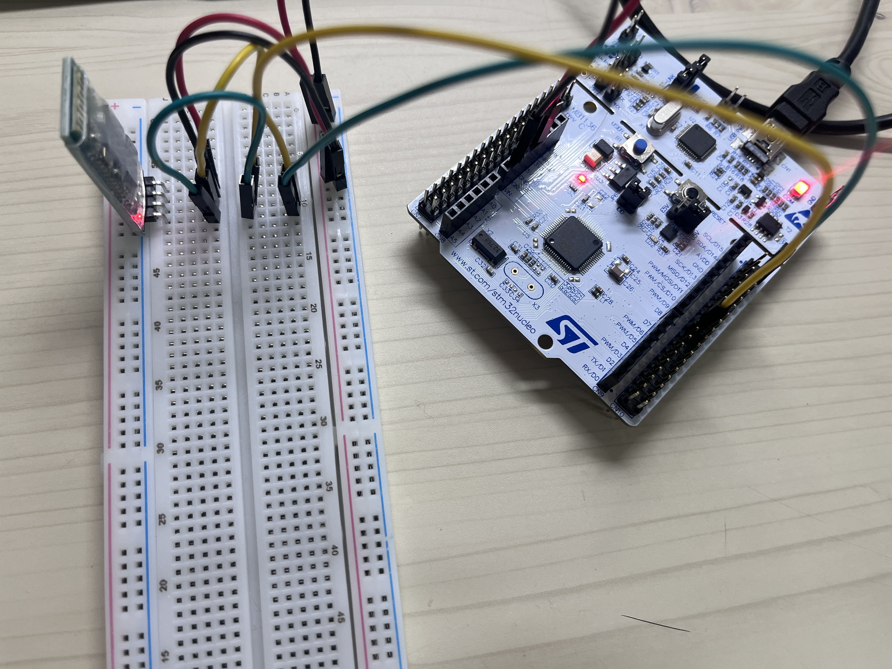

# Phase 5: HC-06 Bluetooth Verification

**Date:** 2026-05-13
**Board:** NUCLEO-F446RE (STM32F446RET6)
**Author:** Yubin Shin

---

## 1. Objective

The HC-06 Bluetooth module serves as the wireless data link from the MCU to the host PC during physical experiments. All sensor data (ToF distance, encoder counts, Kalman filter outputs, TinyML features) are streamed in real time over Bluetooth Serial Port Profile (SPP) at 50 Hz. This phase verifies that the HC-06 can sustain a continuous 18-field CSV stream at 50 Hz over UART + SPP without packet loss, framing errors, or sequence gaps.

This is a prerequisite for Phase 6 (sensor + KF integration) and Phase 7 (full system integration with motors on), where reliable telemetry is required to capture experimental data for post-run analysis.

## 2. Background

### 2.1 HC-06 Module

The HC-06 is a Bluetooth 2.0 + EDR module implementing the Serial Port Profile (SPP). It exposes a transparent UART interface on the MCU side and appears as a virtual COM port on the paired host. The unit used in this project (SZH-EK010, 4-pin DIP) is a Linvor-firmware clone operating at 3.3 V with a default UART baud rate of 9600.

### 2.2 AT Command Mode

Before pairing, the HC-06 accepts AT commands over its UART interface to configure baud rate, device name, and pairing PIN. Unlike standard AT command conventions, this firmware variant expects commands **without CRLF terminators** and responds with bare ASCII strings (`OK`, `OK115200`, etc.). This deviation is a major source of debugging difficulty (see §7).

### 2.3 Bandwidth Requirement

The target CSV format has 18 fields per row. With typical numeric content and CRLF termination, each row averages 160 bytes. At 50 Hz, this requires:

```
160 bytes × 50 Hz = 8,000 bytes/s ≈ 80,000 bits/s (8N1 framing)
```

The default 9600 baud rate provides only 960 bytes/s, which is insufficient. The module must therefore be reconfigured to 115200 baud, providing ~11,520 bytes/s of headroom.

### 2.4 NUCLEO-F446RE SB62/SB63 Solder Bridge Issue

On the NUCLEO-F446RE, PA2/PA3 (USART2) are routed to the ST-LINK virtual COM port by default. The Morpho header connection to PA2/PA3 is gated by solder bridges SB62 and SB63, which ship **open from the factory**. This means PA2 is not physically accessible at the Morpho header without soldering, making USART2 unusable for an external HC-06 connection in a no-solder workflow.

## 3. Hardware Configuration

### 3.1 Wiring Diagram



### 3.2 Components

| Component | Specification | Role |
|-----------|---------------|------|
| MCU board | NUCLEO-F446RE | UART host |
| Bluetooth module | HC-06 (SZH-EK010, 4-pin DIP, Linvor firmware) | Wireless UART bridge |
| Operating voltage | 3.3 V | Direct from NUCLEO 3.3 V pin |
| Host PC | Windows 11 + built-in Bluetooth adapter | SPP virtual COM endpoint |

### 3.3 Pin Assignments

UART2 (PA2/PA3) was abandoned due to the SB62/SB63 issue. The MCU-side interface was migrated to USART6:

| Function | Pin | Peripheral | Notes |
|----------|-----|------------|-------|
| HC-06 RX (MCU TX) | PC6 | USART6_TX, AF8 | DMA TX enabled (DMA2 Stream6) |
| HC-06 TX (MCU RX) | PC7 | USART6_RX, AF8 | Interrupt enabled |
| HC-06 VCC | 3V3 | NUCLEO 3.3 V pin | 40 mA operating, 1 mA standby |
| HC-06 GND | GND | Common ground | — |
| Debug UART | PA2/PA3 | USART2 | ST-LINK VCP, 115200 baud |

### 3.4 Power Considerations

The HC-06 SZH-EK010 module accepts 3.3 V directly (bare DIP, no onboard LDO). The NUCLEO 3.3 V rail provides sufficient current for the module's 40 mA peak draw, eliminating the need for a separate buck converter during this verification phase.

## 4. CubeMX / CubeIDE Configuration

### 4.1 USART6

| Parameter | Value |
|-----------|-------|
| Mode | Asynchronous |
| Baud Rate | 115200 (final, after baud change) |
| Word Length | 8 bits |
| Parity | None |
| Stop Bits | 1 |
| HW Flow Control | None |
| DMA TX | DMA2 Stream6, Channel 5, Memory→Peripheral, Normal mode |
| Global Interrupt | Enabled (for DMA TX complete callback) |

### 4.2 Other Settings

- System clock: 180 MHz via HSE BYPASS (8 MHz ST-LINK MCO)
- USART2 retained for ST-LINK VCP debug output

## 5. Firmware Implementation

### 5.1 Baud Change Sequence (One-Time Setup)

The HC-06 baud change procedure was implemented as a one-shot routine in `USER CODE BEGIN 2`. The MCU UART is initialized at 9600 baud to match the HC-06 factory default, then two AT commands are issued:

```c
// 1. Confirm communication
char at[] = "AT";              // No CRLF
HAL_UART_Transmit(&huart6, (uint8_t*)at, 2, 100);
HAL_UART_Receive(&huart6, rx, 63, 3000);
// Expected response: "OK" (2 bytes, no CRLF)

// 2. Change baud to 115200 (persistent in EEPROM)
char baud_cmd[] = "AT+BAUD8";  // No CRLF; BAUD8 = 115200
HAL_UART_Transmit(&huart6, (uint8_t*)baud_cmd, 8, 100);
HAL_UART_Receive(&huart6, rx2, 63, 3000);
// Expected response: "OK115200" (8 bytes, no CRLF)
```

After the baud change is confirmed, the `.ioc` USART6 baud is updated to 115200, the firmware is rebuilt, and the AT command block is removed. The HC-06 retains the new baud setting permanently in EEPROM.

### 5.2 50 Hz CSV DMA Streaming

The main loop sends one 18-field CSV row every 20 ms (50 Hz target) using non-blocking DMA transmission:

```c
if (HAL_GetTick() - last_blink_ms >= 20) {
    last_blink_ms = HAL_GetTick();
    loop_count++;

    static char csv_buf[256];  // static: must outlive DMA transfer
    int len = snprintf(csv_buf, sizeof(csv_buf),
        "%lu,%lu,0,0,0.0,0.0,0,0,0.0,0.0,0.0,0.0,0.0,0.0,0.0,0.0,0.0,0\r\n",
        loop_count, HAL_GetTick());

    HAL_StatusTypeDef tx_st = HAL_UART_Transmit_DMA(&huart6, (uint8_t*)csv_buf, len);
    if (tx_st != HAL_OK) drop_count++;  // Previous DMA still in flight
}
```

Key design decisions:

- **Static buffer:** `csv_buf` must survive past the function scope until DMA completes. A stack-allocated buffer would be invalidated before transmission finishes.
- **Drop counter:** `HAL_UART_Transmit_DMA` returns `HAL_BUSY` if the previous transfer has not completed. This is counted rather than blocking, providing real-time visibility into bandwidth saturation.
- **18 fields, CRLF terminator:** Matches the planned thesis CSV format (seq, timestamp_ms, encoders, ToF, KF outputs, residual stats, scenario_id).

## 6. Test Procedure and Results

### 6.1 Step 0: Baud Change

**Procedure:** Flash the baud change firmware. Open PuTTY on the ST-LINK VCP at 115200 to observe the AT command exchange.

**Result:** Both AT commands received the expected bare-ASCII responses on the first attempt:

```
AT response bytes: 0x4F 0x4B
AT response as string: "OK"
BAUD response bytes: 0x4F 0x4B 0x31 0x31 0x35 0x32 0x30 0x30
BAUD response as string: "OK115200"
```

After a reset with USART6 reinitialized at 115200 baud, the AT command was reissued and received the same `OK` response, confirming the new baud rate is persistent.

**Verdict:** PASS

### 6.2 Step 1: PC Pairing and 1 Hz Continuity Test

**Procedure:**
1. Pair the HC-06 with Windows 11 (PIN: 1234)
2. Add the HC-06 outgoing SPP COM port via Bluetooth Settings → COM Ports → Add (Outgoing, SPP)
3. Confirm the resulting COM5 endpoint
4. Flash firmware sending `"Hello from STM32 #N\r\n"` at 1 Hz over USART6
5. Open PuTTY on COM5 at 115200 baud and observe reception

**Result:** 54 consecutive messages received without loss, gap, or corruption over approximately 54 seconds. The HC-06 LED transitioned from blinking (pairing mode) to solid (connected) when PuTTY opened COM5, confirming the SPP channel was active.

**Verdict:** PASS

### 6.3 Step 2: 50 Hz CSV 18-Field DMA Streaming

**Procedure:**
1. Flash the 50 Hz CSV firmware (see §5.2)
2. Open two PuTTY sessions simultaneously:
   - ST-LINK VCP for live transmit count and drop counter
   - COM5 (Bluetooth SPP) with logging to file (`puttyBT.log`)
3. Reset the NUCLEO and allow the system to run for approximately 20 seconds
4. Close PuTTY to flush the log file

**Transmit side (ST-LINK VCP, final reading):**

```
CSV sent: 2750, dropped: 0
```

**Receive side (Bluetooth, puttyBT.log):**

| Metric | Value |
|--------|-------|
| Total received lines | 997 |
| Sequence range captured | 1695 – 2691 |
| Lines with exactly 18 fields | 996 |
| Lines with fewer fields | 1 (final line, truncated by PuTTY close) |
| Sequence gaps | 0 |
| Duplicate sequences | 0 |

The receive side captures a 997-row window from the middle of the run because PuTTY logging was started after the firmware was already streaming. Within this window, every consecutive sequence number from 1695 to 2691 is present with no missing or duplicated rows, and every fully-received line contains exactly 18 comma-separated fields.

**Verdict:** PASS

**Interpretation:**

- Transmit side: 2,750 attempted writes, 0 DMA-busy drops over ~55 seconds (50 Hz × 55 s = 2,750 rows). DMA never failed to accept a new transfer, indicating the prior transfer always completed within the 20 ms slot.
- Receive side: 997 / 997 = 100 % sequence continuity within the captured window. The single 3-field line at the end is a PuTTY-side artifact, not a transmission error.
- Combined: the MCU → HC-06 → SPP → COM5 → PuTTY path sustains 50 Hz × 18-field CSV without loss for at least 55 seconds of continuous operation.

## 7. Troubleshooting Log

### Issue 1: SB62/SB63 Open by Default on NUCLEO-F446RE

**Symptom:** USART2 TX (PA2) measured 0 V at the Morpho header during continuous transmission, despite the firmware being verified correct and the ST-LINK VCP showing transmitted data.

**Root cause:** Solder bridges SB62 (PA2) and SB63 (PA3) are open from the factory on the NUCLEO-F446RE, disconnecting USART2 from the external Morpho headers. Only the ST-LINK MCU sees this UART; nothing reaches CN9 or CN10.

**Resolution:** Migrate the HC-06 UART interface from USART2 (PA2/PA3) to USART6 (PC6/PC7). No soldering required.

**Lesson:** When using a NUCLEO board's UART externally, always verify the solder bridge state in the user manual (UM1724 §6.4) or use a UART that is not gated by bridges.

### Issue 2: AT Command CRLF Terminator Trap

**Symptom:** After hardware was verified end-to-end (USART6 GPIO mode = AF8, BRR register correct, PC6/PC7 voltages at idle 3 V), the HC-06 still failed to respond to AT commands sent with `\r\n` terminators. Multimeter measurements confirmed signal propagation. Both HC-06 modules and both NUCLEO boards were swapped with no effect.

**Root cause:** The Linvor HC-06 clone variant expects AT commands **without any CRLF terminator**. Sending `"AT\r\n"` causes the module to silently discard the command. Standard AT-command conventions inherited from modem protocols mislead users into appending CRLF, which is incorrect for this firmware variant.

**Resolution:** Send `"AT"` and `"AT+BAUD8"` as bare ASCII without any terminator. Responses arrive as bare strings (`"OK"`, `"OK115200"`) without trailing CRLF either.

**Lesson:** For black-box modules, always consult the vendor's quick-start guide before assuming protocol conventions. The Devicemart product page for SZH-EK010 explicitly documents the CRLF-less format, but this was missed during initial implementation.

### Issue 3: DMA Transmission Requires Persistent Buffer

**Symptom:** Initial implementations using a stack-allocated `csv_buf[256]` produced garbage output or no output at all.

**Root cause:** `HAL_UART_Transmit_DMA` is non-blocking. The DMA engine continues to read from the buffer after the calling function returns, but stack frames are reused immediately upon function return, corrupting the in-flight data.

**Resolution:** Declare `csv_buf` as `static` to give it function-local lifetime that persists across calls. A global buffer or heap allocation would also work, but `static` is the simplest fit for a single-shot per iteration pattern.

**Lesson:** Any buffer passed to a DMA-based transmit function must outlive the transfer, not the function call.

### Issue 4: Windows Bluetooth COM Port Not Auto-Created

**Symptom:** After successful HC-06 pairing on Windows 11, no virtual COM port appeared in Device Manager.

**Root cause:** Windows 11 pairs the HC-06 at the L2CAP level but does not automatically register the SPP service as a virtual COM port. The Bluetooth quick-pair flow only handles HID and audio profiles.

**Resolution:** Open Bluetooth Settings → "More Bluetooth settings" → "COM Ports" tab → Add → "Outgoing" → select HC-06 → SPP service. This creates the outgoing COM port (COM5 in this setup).

**Lesson:** For SPP devices on Windows 11, manual COM port registration is required after pairing. The pairing dialog completes successfully but provides no visual indication that this step is needed.

## 8. Confirmed Parameters

| Parameter | Value |
|-----------|-------|
| MCU UART | USART6 (PC6 TX, PC7 RX, AF8) |
| Baud rate (final) | 115200 |
| DMA channel | DMA2 Stream6 Channel 5 (TX only) |
| HC-06 power | 3.3 V direct from NUCLEO |
| HC-06 pairing PIN | 1234 |
| HC-06 baud (EEPROM) | 115200 (persistent) |
| Host SPP COM port | COM5 (Outgoing) on Windows 11 |
| CSV row format | 18 comma-separated fields, CRLF-terminated |
| Streaming rate | 50 Hz (20 ms period) |
| Bandwidth used | ~8,000 bytes/s out of ~11,520 bytes/s (≈70 % utilization) |

## 9. Discussion and Limitations

### 9.1 Measured Bandwidth Margin

At 50 Hz and ~160 bytes per row, the link uses approximately 70 % of the 115200 baud channel capacity. The 30 % headroom absorbs Bluetooth packet retransmissions, SPP framing overhead, and OS-level scheduling jitter. No drops were observed in 55 seconds of continuous operation, indicating this margin is sufficient for steady-state operation.

### 9.2 Drop Counter Methodology

The MCU-side drop counter detects only DMA-busy conditions (previous transfer not complete). It does not detect drops downstream of the HC-06 (RF errors, OS buffer overflows). Independent verification via the receive-side sequence number gap analysis is therefore essential. In this run, both sides agreed: MCU reported 0 drops, and the receive log showed 0 sequence gaps.

### 9.3 Test Duration Limitation

The verification run captured approximately 55 seconds of streaming. Longer runs (full experimental scenarios are 30 seconds each, but back-to-back data collection sessions could extend much longer) have not been stress-tested for thermal drift, HC-06 firmware quirks, or Bluetooth stack instability. This will be evaluated implicitly during Phase 6 and Phase 7 integration.

### 9.4 Receive Log Window

The Bluetooth-side PuTTY log captured only a 997-row middle window of the 2,750-row run because logging was started after transmission was already in progress. The window covers a representative 20-second slice with full sequence continuity, but it does not include the startup or shutdown transients. A future end-to-end run with PuTTY logging armed before reset would close this gap.

### 9.5 Single-Direction Verification

This phase verifies MCU → PC streaming only. Bidirectional commands (PC → MCU for scenario control, calibration commands, etc.) are out of scope here and will be added if the final test protocol requires them.

## 10. Next Steps

Phase 5 verification is complete. The Bluetooth telemetry link is ready for integration in subsequent phases:

- **Phase 4-B:** Motor + sensor noise delta test. The HC-06 link will provide live telemetry to compare sensor readings with motors on vs. off.
- **Phase 6:** Sensor + KF integration at 200 Hz internal loop, with 50 Hz CSV decimation over Bluetooth (LOG_DECIMATION = 4). The 50 Hz rate verified in this phase matches the planned decimated output.
- **Phase 7:** Full integration with motors on. All experimental scenarios (E1–E5) will use this Bluetooth link to log CSV data for offline analysis.

The MCU firmware's temporary baud-change code block will be removed and the `csv_buf` formatting expanded to include real sensor and KF data once Phases 4-B / 6 are underway.

## Appendix A: Captured PuTTY Logs

- `logs/puttyST_50hz_csv.log` — ST-LINK VCP output showing transmit count and drop counter (final reading: `CSV sent: 2750, dropped: 0`)
- `logs/puttyBT_50hz_csv.log` — Bluetooth COM5 receive log (997 lines, seq 1695–2691, 0 gaps)
- `logs/putty_baud_change_9600.log` — Baud change verification (AT and AT+BAUD8 responses captured at 9600 baud)
- `logs/putty_baud_verify_115200.log` — Post-change verification (AT response captured at 115200 baud)

## Appendix B: Reference Documents

- ST UM1724 — STM32 Nucleo-64 boards user manual (SB62/SB63 description, §6.4)
- HC-06 / Linvor SZH-EK010 quick-start guide (Devicemart product page)
- STM32F446xx Reference Manual — DMA controller (RM0390, Chapter 9)
